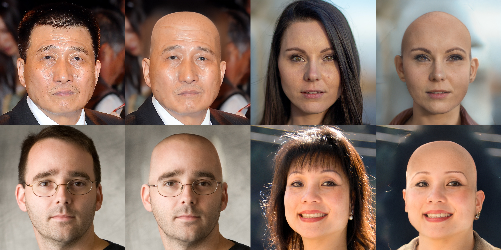

# BaldHairGenerator



## Installation
- Clone the repository:
``` 
git clone https://github.com/hunsii/BaldHairGenerator
cd BaldHairGenerator
```


## Download II2S images
Please download the [II2S](https://drive.google.com/drive/folders/15jsR9yy_pfDHiS9aE3HcYDgwtBbAneId?usp=sharing) 
and put them in the `input/face` folder.

## Download pretrained models
Please download the pretrained StyleGAN model from [II2S](https://drive.google.com/drive/folders/15jsR9yy_pfDHiS9aE3HcYDgwtBbAneId?usp=sharing)
and put them in the `pretrained_models/` folder.


## Getting Started  
Preprocess your own images. Please put the raw images in the `unprocessed` folder.
Processed images is in `input/face/` folder.
```
python align_face.py
```


Produce realistic results:
```
python main.py --im_path1 14.png
```

If you have latent code in W+ latent space, you can use it and reduce running time.
```
python main.py --im_path1 14.png --W_saved_latent input/latent/14.npz --W_steps 0
```
## Acknowledgments
This code borrows heavily from [Barbershop](https://github.com/ZPdesu/Barbersho).
